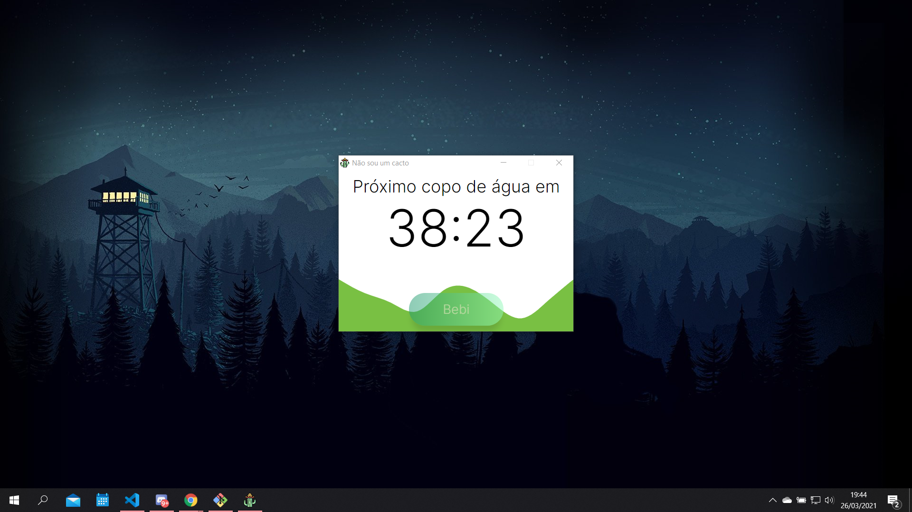

<h1 align="center">Não sou um cacto</h1>

<h2 align="center">
    
</h2>

---

<h2 id="about">📖 About it</h2>

<br>

<p>&nbsp;&nbsp;&nbsp;&nbsp;The <strong>Não sou um cacto</strong> is a desktop application, built with <strong>Electron</strong> framework, wich is based on JavaScript. The goal of the application is to simply run in the background to remind its users, through notification, to hydrate from time to time.</p>
<p>&nbsp;&nbsp;&nbsp;&nbsp;The development of this project was done to put some concepts of JavaScript into practice, like the EventEmitter and setInverval, in addition to provide a first contact with <strong>Electron</strong>.</p>
<p>&nbsp;&nbsp;&nbsp;&nbsp;The application runs in the background and can be accessed through <i>tray</i> wich is displayed on the taskbar of the desktop. Finally, a <i>script</i> was setted in the "package.json" file, wich when executed, generates an executable file with the project icon.</p>


<br>

---

<h2 id="techs">🛠 Languages, techs and tools</h2>

<br>

* HTML5;
* CSS3;
* JavaScript;
* Electron;
* Visual Code Studio;

<br>

---

<h2 id="run">⚙️ How to Run</h2>

<p>&nbsp;&nbsp;&nbsp;&nbsp;To run the application locally, you must first install <a href="https://git-scm.com" target="_blank">Git</a>, <a href="https://nodejs.org/en/" target="_blank">Node.js</a> and <a href="https://code.visualstudio.com/" target="_blank">VSCode</a>.</p>

<br>

<h3>🧭 Running the application</h3>

<br>

```bash
# Clone this repository
git clone https://github.com/magaliais/cacto-app.git

# Find the directory
cd cacto-app

# Download dependencies
npm install

# Run the application
npm start or npm run start
```

<p>&nbsp;&nbsp;&nbsp;&nbsp;After this, an icon should appear on your desktop <i>tray</i>. To open it, simply click the icon. To shut down the application, right click the cactus icon and click on "Encerrar".</p>
<p>&nbsp;&nbsp;&nbsp;&nbsp;Instead, you can try to create the executable file via terminal:</p>

```bash
# Clone this repository
git clone https://github.com/magaliais/cacto-app.git

# Find the directory
cd cacto-app

# Download dependencies
npm install

# Run the application
npm run build
```
<p>&nbsp;&nbsp;&nbsp;&nbsp;After this, a "packages" folder should be created inside the application folder. To run, simply click the executable file:</p>

<p align="center"></p>

---

<h2 id="contribute">💪 How to contribute</h2>

<br>

<ol>
    <li>Fork the project.</li>
    <li>Create a new branch with your changes: `git checkout -b my-feature`.</li>
    <li>Save your changes and commit describing what you did: git commit -m "feature: My new feature".</li>
    <li>Submit your changes: git push origin my-feature</li>
</ol>

<br>

---

<br>

Code by <a href="https://www.github.com/magaliais">magaliais</a> 👨‍💻.